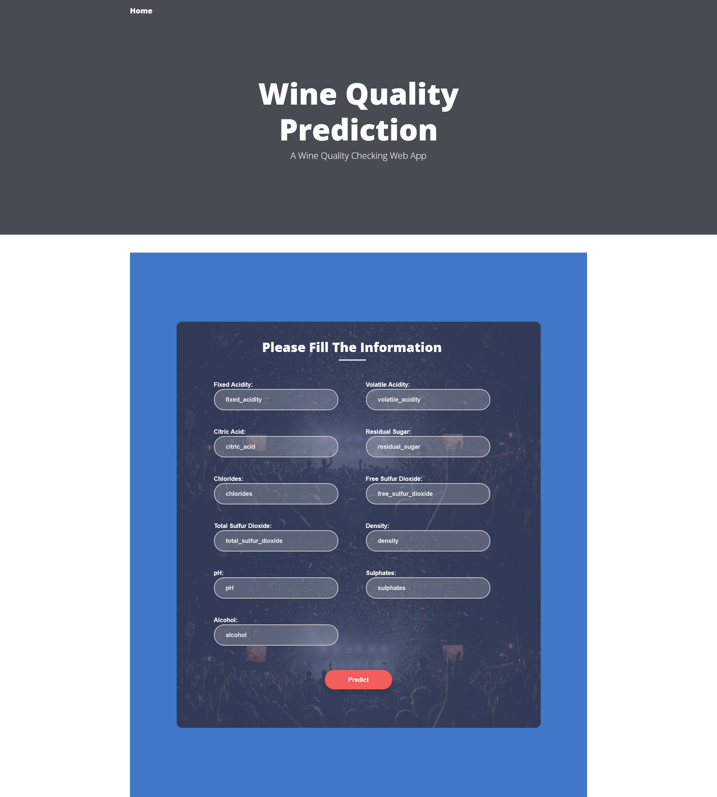

# Wine Quality Prediction with MLflow

This project demonstrates wine quality prediction using machine learning techniques and manages the experiment tracking and model deployment using MLflow. The dataset contains various features related to the chemical composition of wines and their corresponding quality ratings.


## Table of Contents
- [Introduction](#introduction)
- [Project Components](#project-components)
- [Technology Used](#technology-used)
- [Installation](#installation)
- [MLflow Tracking](#mlflow-tracking)
- [AWS CICD Deployment with Github Actions](#aws-cicd-deployment-with-github-actions)
- [Preview of Wine Quality Prediction in Action](#preview-of-wine-quality-prediction-in-action)
- [License](#license)

## Introduction

This project uses machine learning to predict wine quality from chemical attributes, and MLflow to manage the machine learning lifecycle including experiment tracking, model development, and deployment.

## Project Components

1. **Data Ingestion**
   - Fetching the dataset from the UCI Wine Quality repository
   - Features include:
     - Fixed Acidity
     - Volatile Acidity
     - Citric Acid
     - Residual Sugar
     - Chlorides
     - Free Sulfur Dioxide
     - Total Sulfur Dioxide
     - Density
     - pH
     - Sulphates
     - Alcohol

2. **Data Validation**
   - Checking for missing/null values
   - Validating data types and feature ranges

3. **Data Transformation**
   - Scaling features
   - Splitting the dataset into training and testing sets
   - Label creation for wine quality

4. **Model Training**
   - Train the model using ElasticNet Regression
   - Track experiments with MLflow, logging metrics like accuracy, precision, and F1-score

5. **Model Evaluation**
   - Evaluation metrics such as:
     - MAE
     - RMSE
     - R2 Score

6. **Train Pipeline**
   - Orchestrates the entire process:
     - Triggers data ingestion, validation, transformation
     - Logs metrics and registers models in the MLflow registry

7. **Prediction Pipeline**
   - Accepts new inputs (wine features)
   - Provides real-time predictions

8. **Deployment**
   - The selected model is dockerized and deployed on an AWS EC2 instance
   - The deployment process is automated using GitHub Actions
   - The Flask API interface is built to accept requests and return predictions

9. **CI/CD Pipeline**
   - GitHub Actions handles:
     - Continuous integration: running tests on commits
     - Continuous deployment: builds Docker image and deploys it on AWS EC2

---

## Workflows
- Update `config.yaml`
- Update `schema.yaml`
- Update `params.yaml`
- Update the entity
- Update the configuration manager in the src config
- Update the components
- Update the pipeline
- Update `main.py`
- Update `app.py`


## Technology Used

This project leverages various technologies to achieve its goals:

- **Programming Language:** Python

- **MLflow:** MLflow is employed for experiment tracking, model versioning, and deployment. It allows us to seamlessly manage the end-to-end machine learning lifecycle.

- **Dagshub:** Dagshub is used for experiment tracking and collaboration, providing an integrated platform to log experiments and share results.


- **Flask:** A modern, fast web framework for building web applications and APIs with Python.

- **Docker:** A platform to develop, ship, and run applications in containers.

- **Amazon Web Services (AWS):** A cloud computing platform that provides various services and tools to facilitate deployment and management of applications.
  - **AWS Identity and Access Management (IAM):** Used to manage access to AWS resources securely.
  - **Elastic Container Registry (ECR):** A managed container registry to store, manage, and deploy Docker container images.
  - **Amazon Elastic Compute Cloud (Amazon EC2):** Provides scalable compute capacity in the cloud, often used to host applications and services.


## Installation
1. Clone the repository:

```bash
https://github.com/manuethomas/Wine-Quality-Prediction-with-MLflow

```

2. Create a conda environment after opening the repository:

```bash
conda create -n mlproj python=3.8 -y
```

4. Activate the conda environment:

```bash
conda activate mlproj
```
5. Install the required dependencies:

```bash
pip install -r requirements.txt
```

6. Run the following command to start the application:

```bash
python app.py
```

7. Open your preferred web browser and visit:

```bash
http://localhost:8080

```

## MLflow Tracking

To integrate MLflow tracking with dagshub, follow these steps:

1. Log in to [dagshub](https://dagshub.com/) and connect your account to GitHub.

2. Connect to your repository and add access.

3. Click on the selected repository for the project name and connect to it.

4. Go to "Remote" and click on "Experiment".

5. Copy the MLflow training command provided.
\
MLFLOW_TRACKING_URI= your tracking uri \
MLFLOW_TRACKING_USERNAME= your username \
MLFLOW_TRACKING_PASSWORD= your password  \
python script.py

Make changes in the "export as env variables" command according to your information:

Run this to export as env variables:

```bash

export MLFLOW_TRACKING_URI= tracking uri

export MLFLOW_TRACKING_USERNAME= username 

export MLFLOW_TRACKING_PASSWORD=passowrd
```


## AWS CICD Deployment with Github Actions


### 1. Login to AWS console

Login to your AWS console using your credentials.

### 2. Create IAM user for deployment

Create an IAM user with specific access for deployment purposes, including EC2 and ECR access. Attach the following policies:

- AmazonEC2ContainerRegistryFullAccess
- AmazonEC2FullAccess

### 3. Create ECR repo to store/save Docker image

Create an Elastic Container Registry (ECR) repository to store your Docker image. Save the repository URI

### 4. Create EC2 machine (Ubuntu)

Create an EC2 instance with the Ubuntu operating system.

### 5. Install Docker in EC2 Machine

Connect to your EC2 instance and install Docker:

```bash
sudo apt-get update -y
sudo apt-get upgrade
curl -fsSL https://get.docker.com -o get-docker.sh
sudo sh get-docker.sh
sudo usermod -aG docker ubuntu
newgrp docker
```

### 6. Configure EC2 as self-hosted runner
Go to your repository settings in GitHub, navigate to Actions, and set up a new self-hosted runner. Choose the appropriate OS and follow the provided commands

### 7. Setup GitHub secrets
In your GitHub repository, go to Settings > Secrets and add the following secrets:

- `AWS_ACCESS_KEY_ID`: Your AWS access key ID.
- `AWS_SECRET_ACCESS_KEY`: Your AWS secret access key.
- `AWS_REGION`: The AWS region you are using
- `AWS_ECR_LOGIN_URI`: The ECR login URI
- `ECR_REPOSITORY_NAME`: The name of your ECR repository

Now, the GitHub Actions workflows can securely access the required AWS resources using these secrets.

## Preview of Wine Quality Predictor

Here's a preview of the Wine Quality Prediction in action:




## License

This project is licensed under the MIT License. See the [LICENSE](LICENSE) file for more details.